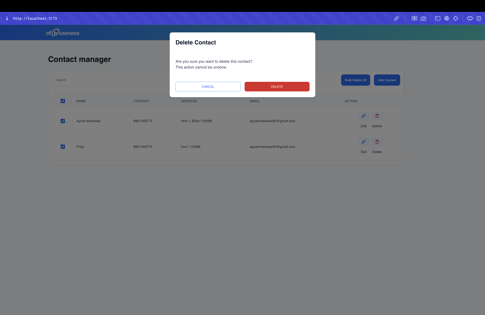
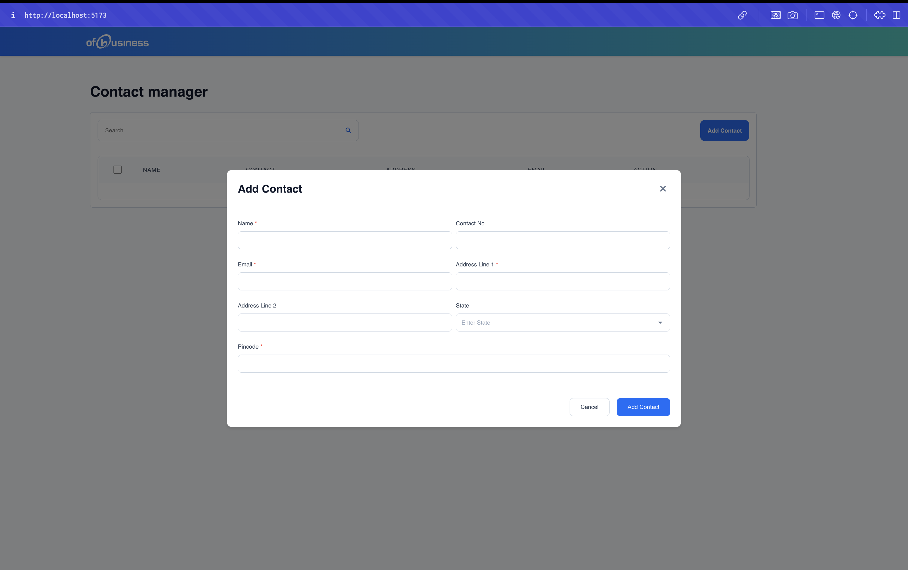
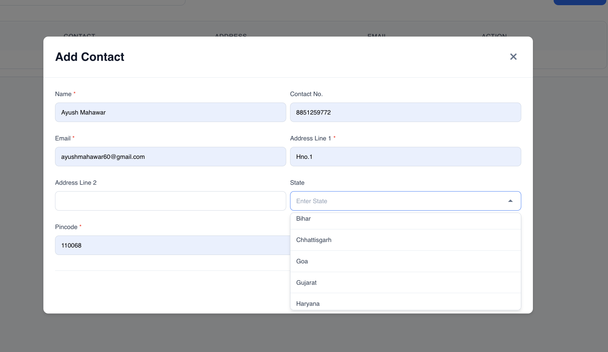
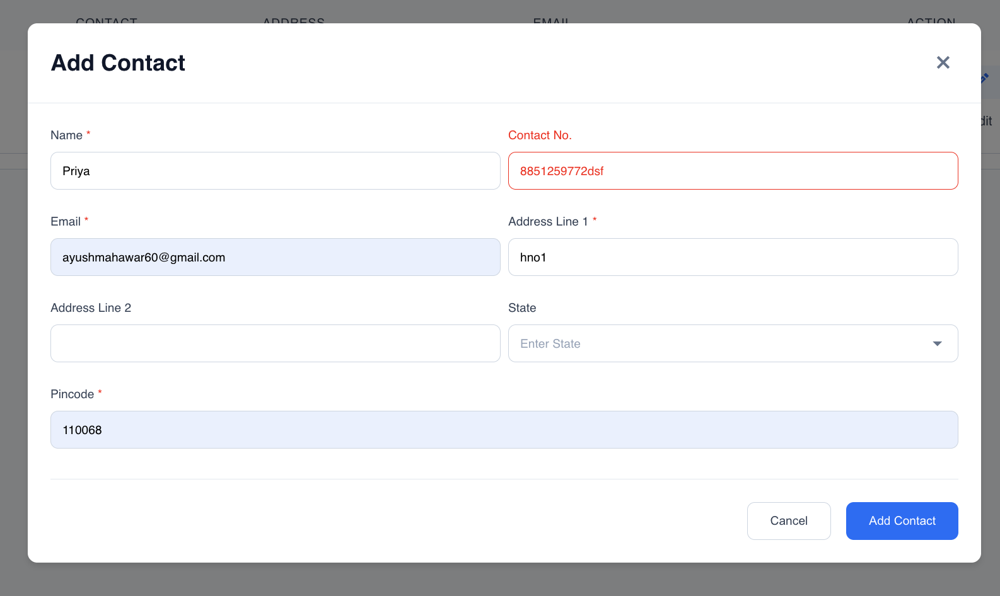

## screenshots







## Run Locally

Clone the project (ssh)

```bash
  git clone git@github.com:ayush-mahawar26/OfBuisness-Assignment.git
```

Go to the project directory

```bash
  cd OfBuisness-Assignment
```

Install dependencies

```bash
  npm install
```

Start the server

```bash
  npm run start
```

